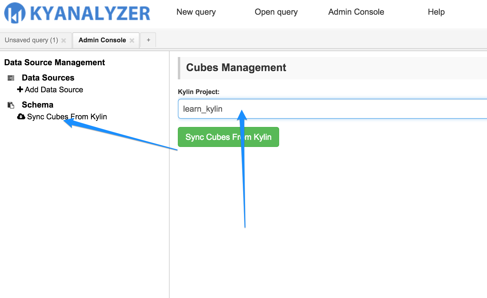
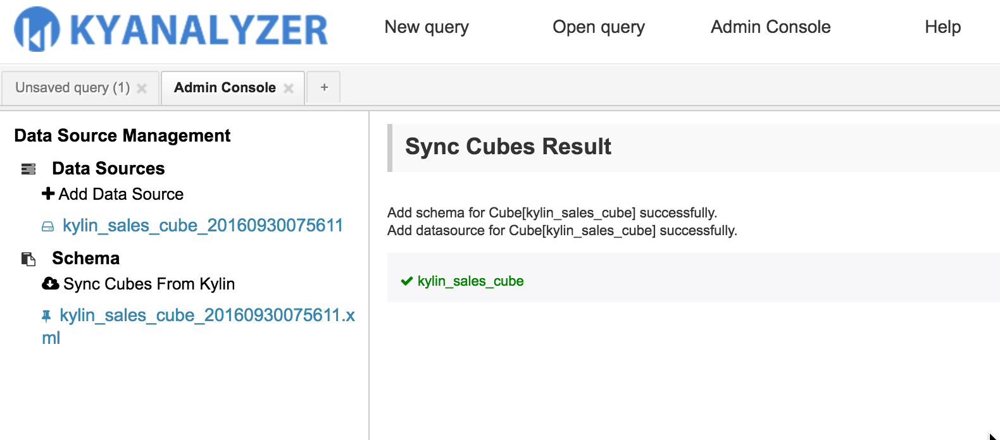
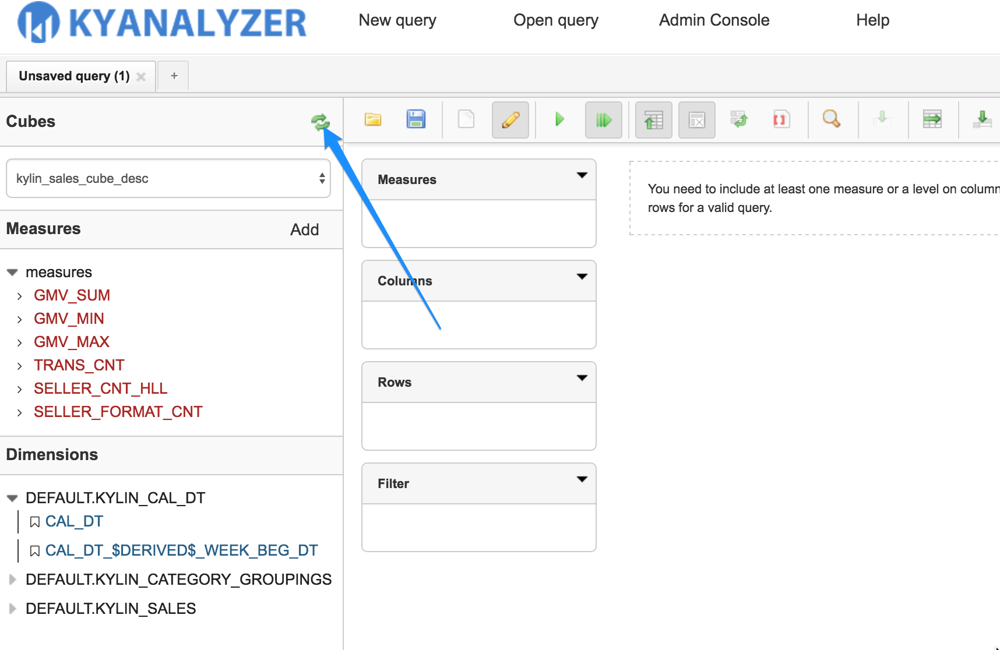
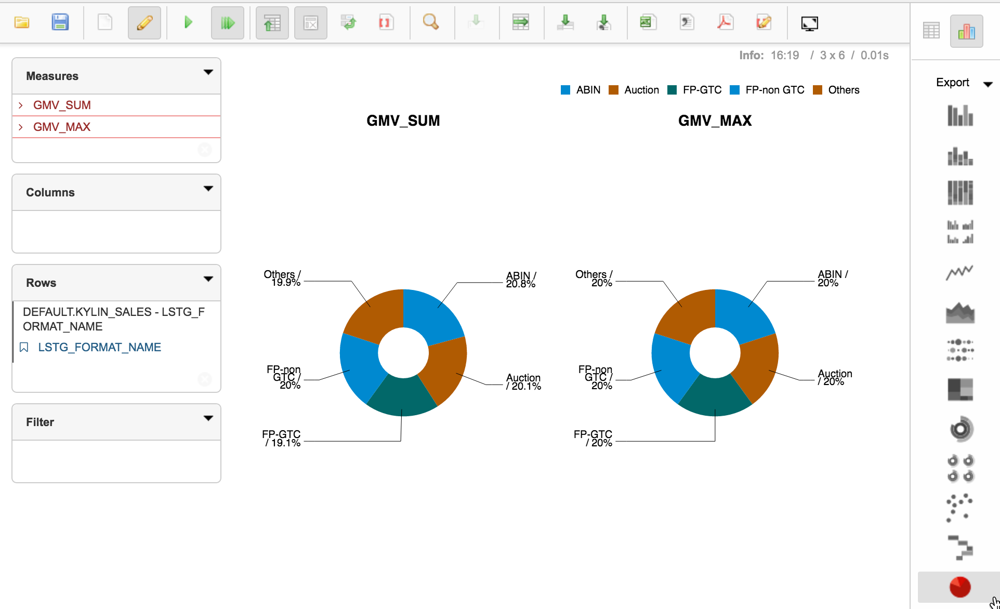
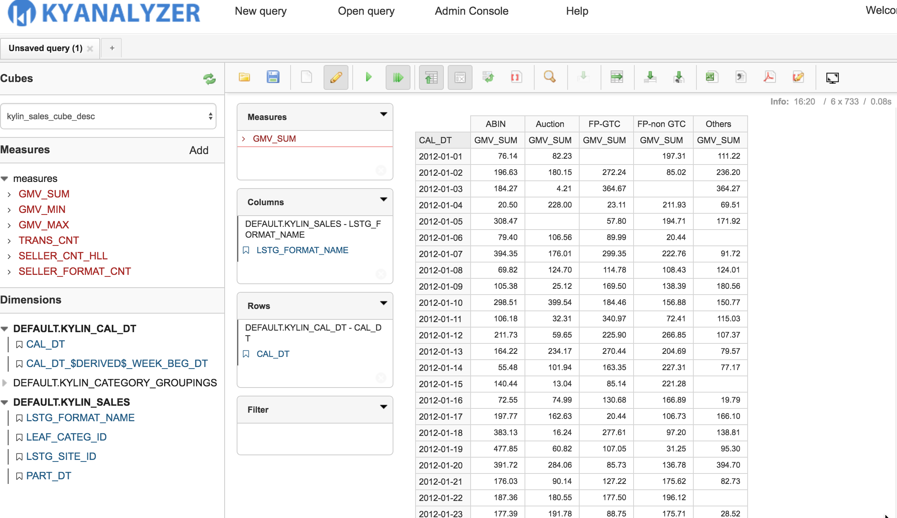
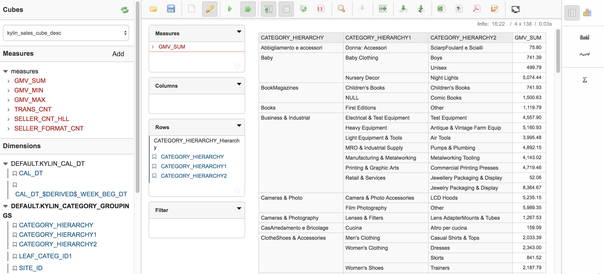

## KyAnalyzer Self-service Agile BI Tools

KyAnalyzer is developed based on open source MOLAP Tools [Saiku](https://github.com/OSBI/saiku). KyAnalyzer has integrated with KAP(Kylin) seemlessly, to make user analyze data easier and quicker.

Compared with Saiku, KyAnalyzer has included the following enhancements and bug fixes:

- Support sync cube from KAP
- Support online editing Schema
- Support integrate KAP user authentication
- Support Distinct Count
- Support embed report into third-party dashboard
- Fix many Saiku bugs

###Pre-Condition

* KAP should be version 2.1 or later
* Apache Kylin version should be 1.5.4.1 or later.
* KyAnalyzer does not supprt *left join*, you should use *inner join* when create cube mode in KAP.

### Install
Get the package KyAnalyzer-{version}.zip from Kyligence Inc, and download the customized mondrian mondrian-kylin-{version}.jar from GitHub kylin-mondrian repository: (https://github.com/Kyligence/kylin-mondrian/blob/master/build/), if the version is updated, please use the latest jar.
Unzip KyAnalyzer package, copy mondrian-kylin-{version}.jar into saiku-server/tomcat/webapps/saiku/WEB-INF/lib.
Edit kyanalyzer-beans.properties in WEB-INF, update KAP host and port to KAP server. The key *kap.host* is the IP address of KAP, and key *kap.port* is the port of KAP REST API, default port is 7070.

Run start-saiku.sh under saiku-server to start KyAnalyzer, the default port is 8080. When the server is started, please visit http://{hostname}:8080. If you want to stop the server, please run stop-saiku.sh.

 If the server is not started normally, please check the logs under tomcat/logs for details.

#### Files under home directory

KyAnalyzer will save data under the directory *repository* and *data*, when you upgrade  KyAnalyzer, need to backup these two directories.

###About KyAnalyzer,KAP,Mondrian-Kylin Version/Features
<table>
    <tr>
    <th>KAP</th>
    <th>KyAnalyzer</th>
    <th>Mondrian-Kylin</th>
    <th>COUNT_DISTINCT</th>
    <th>TOP_N</th>
    <th>Normal Query</th>
    <th></th>
    </tr>
    <tr>
        <td>2.0</td>
        <td>2.1</td>
        <td>1.0</td>
        <td>❎</td>
        <td>❎</td>
        <td>✅</td>
        <td></td>
    </tr>
    <tr>
        <td>2.0</td>
        <td>2.1</td>
        <td>1.1</td>
        <td>✅</td>
        <td>❎</td>
        <td>❎</td>
        <td></td>
    </tr>
    <tr>
        <td>2.1</td>
        <td>2.1</td>
        <td>1.0</td>
        <td>❎</td>
        <td>❎</td>
        <td>✅</td>
        <td></td>
    </tr> 
    <tr>
        <td>2.1</td>
        <td>2.1</td>
        <td>1.1</td>
        <td>✅</td>
        <td>✅</td>
        <td>✅</td>
        <td>Recommended</td>
    </tr>     
</table>

###About KyAnalyzer,Apache Kylin,Mondrian-Kylin Version/Features
<table>
    <tr>
    <th>Apache Kylin</th>
    <th>KyAnalyzer</th>
    <th>Mondrian-Kylin</th>
    <th>COUNT_DISTINCT</th>
    <th>TOP_N</th>
    <th>Normal Query</th>
    <th></th>
    </tr>
    <tr>
        <td>ALL</td>
        <td>2.1</td>
        <td>1.0</td>
        <td>❎</td>
        <td>❎</td>
        <td>✅</td>
        <td></td>
    </tr>
    <tr>
        <td>version earlier than1.5.4.1</td>
        <td>2.1</td>
        <td>1.1</td>
        <td>✅</td>
        <td>❎</td>
        <td>❎</td>
        <td></td>
    </tr>
    <tr>
        <td>1.5.4.1</td>
        <td>2.1</td>
        <td>1.1</td>
        <td>✅</td>
        <td>❎</td>
        <td>✅</td>
        <td></td>
    </tr> 
    <tr>
        <td>version later 1.5.4.1</td>
        <td>2.1</td>
        <td>1.1</td>
        <td>✅</td>
        <td>✅</td>
        <td>✅</td>
        <td>Recommended</td>
    </tr>         
</table>

### Authentication
KyAnalyzer authenticates user at KAP side, so you can use KAP user and password to login. Users with *Admin* Role in KAP are also *Admin* in KyAnalyzer.

### Admin Page
Only the admin could visit this page.
To import the Cube from KAP, Saiku needs to create schema and datasource for each cube in KAP by default. KyAnalyzer automatize the flow, user don't have to write schema by themeselves.
Click `Sync Cubes From Kylin` on the left side, the right panel will list all projects from KAP.

Click the green button `Sync Cubes From Kylin` after select project, KyAnalyzer will create *schema* and *datasource* for all cubes under this project whose status is 'READY'.

The schema could be edited online in KyAnalyzer, it's not necessary at most time.

### New Query
Click `New Query` button at navigation bar, then click `Refresh` button to fetch the latest meta data, select the cube under *Cubes* menu, now all dimensions and measures are shown. In the report designer area, here are four panels: *Measures*, *Columns*, *Rows*, *Filter*. User could drag measures into Measures panel, and dimensions into Columns and Rows panels.

KyAnalyzer supports many types of visulization, table, bar, stacked bar, line chart, area chart, heat grid, tree map, pie chart, dot chart, water fall chart ,etc.

#### Bar

#### Pie

#### Pivotal Table

#### COUNT DISTINCT

#### Hierarchy Data

### Result Filter
To filter the results, you can click the dimension name and see the filter dialog, input the search pattern to filter the select options, and select your options, you can include or exclude the options.

### Save Query Result
You can export results to files(csv, pdf, excel) or pictures.

#### Export grid to files

#### Export chart to picture

### Save query results in KyAnalyzer
The query result could be saved in KyAnalyzer, so next time when you login, you don't have to select your dimensions and measures again.

#### Save Query

#### Open Query

#### Execute Query

