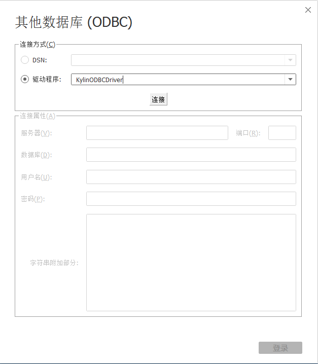
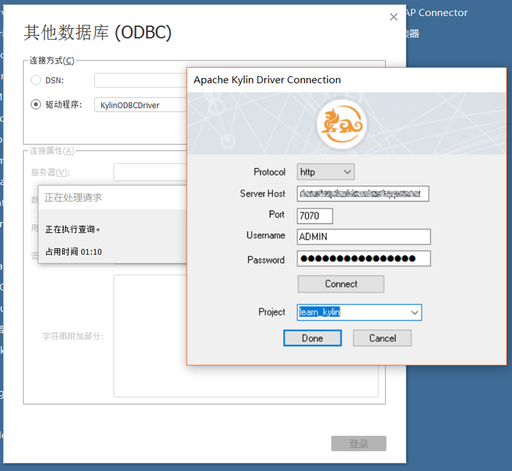
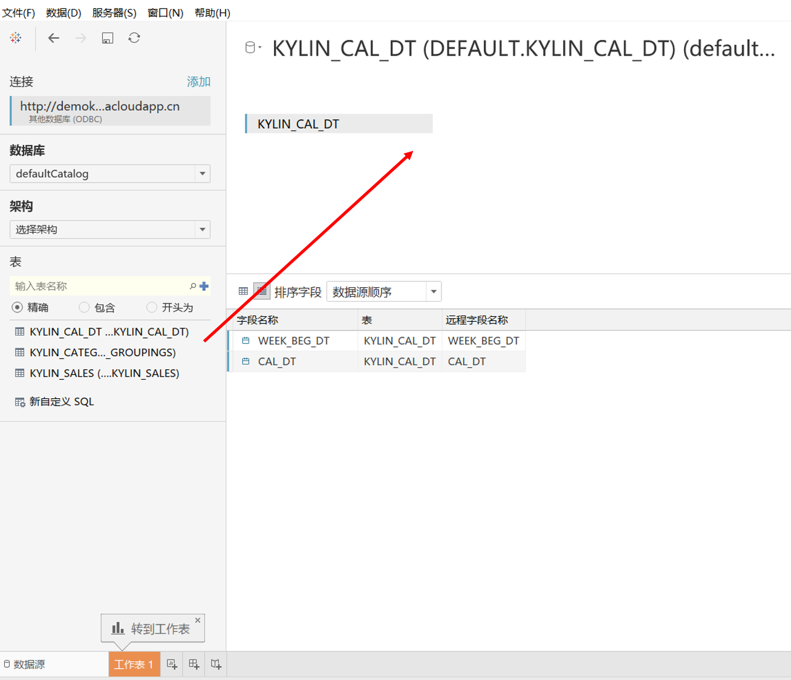
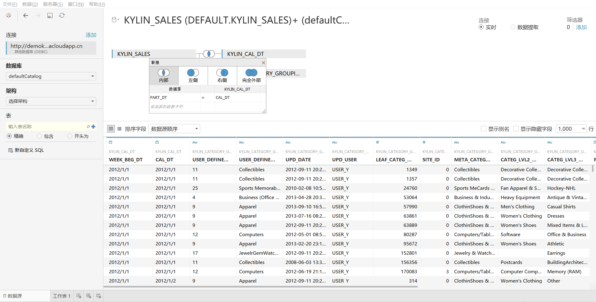
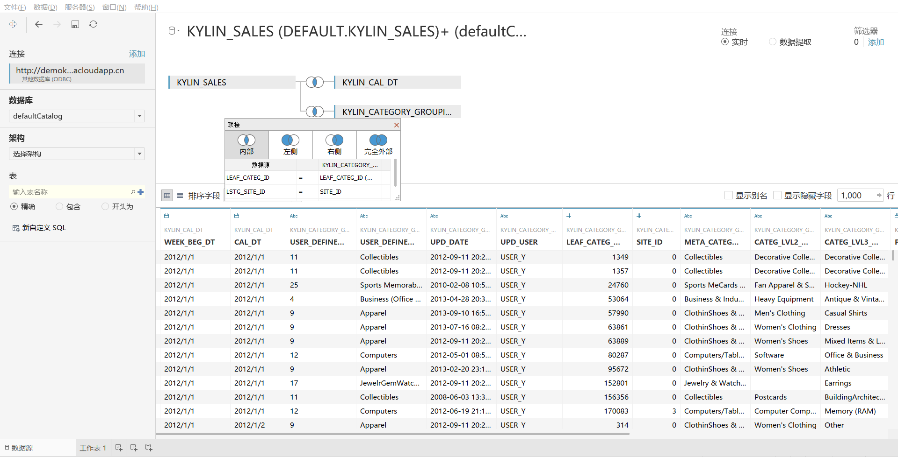
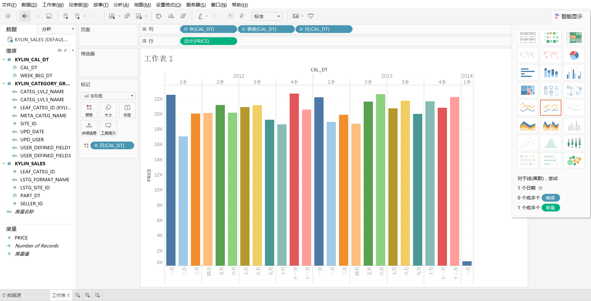

## Integration with Tableau 10.x

### Install ODBC Driver
Refer to this guide: [Kylin ODBC Driver Tutorial](driver/odbc.en.md).

Please make sure to download and install Kylin ODBC Driver v1.5. If you already installed ODBC Driver in your system, please uninstall it first.  

### Connect to Kylin Server
Connect Using Driver: Start Tableau 9.1 desktop, click `Other Database(ODBC)` in the left panel and choose KylinODBCDriver in the pop-up window. 

Provide your Sever location, credentials and project. Clicking `Connect` button, you can get the list of projects that you have permission to access, see details at [Kylin Cube Permission Grant Tutorial](./acl.html).

### Mapping Data Model
In left panel, select `defaultCatalog` as Database, click `Search` button in Table search box, and all tables get listed. Drag the table to right side, then you can add this table as your data source and edit relation between tables(mapping information is shown in figure).

### Connect Live

There are two types of Connection in Tableau 10.1, choose the Live option to make sure using Connect Live mode.

### Custom SQL
To use customized SQL, click `New Custom SQL` in left panel and type SQL statement in pop-up dialog.

### Visualization

Now you can start to enjou analyzing with Tableau 10.1.

### Publish to Tableau Server
If you want to publish local dashboards to a Tableau Server, just expand `Server` menu and select `Publish Workbook`.

