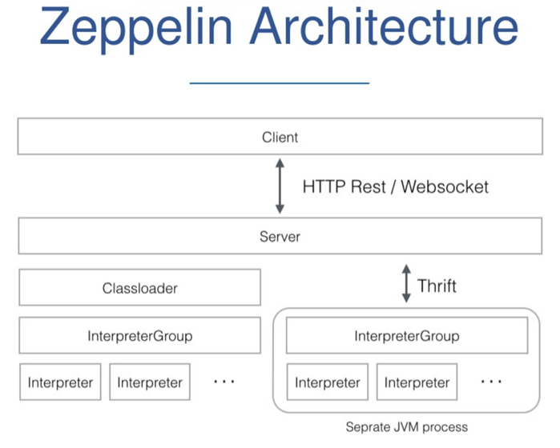
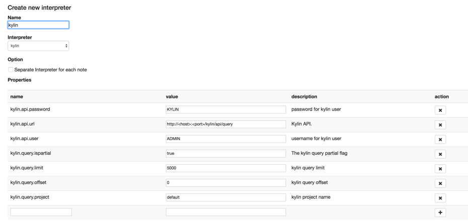
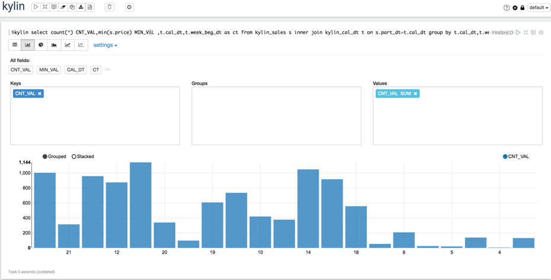

## Apache Zepplin Integration

Apache Zeppelin, an open source data analysis platform, is a top program of Apache； its back-end has multiple components to support a variety of data processing engine, such as Spark, Flink, Lens and so on; and provide notebook type UI to process visualization related operations. KAP has developed  corresponding Zeppelin modules and merged them with Zeppelin's major branches.  Correspondingly KAP is accessible with Zeppelin 0.5.6 and subsequent version.

### Zeppelin Architecture Introduction
As following charts show, Zeppelin client is capable to interact  with servers through both HTTP Rest and Websocket. On the servers, Interpreter is supported by Zeppelin. For Kylin, users only need to develop Kylin-Interpreter and enable it integrate with Zeppelin, then users can correspond with Kylin server via Zeppelin's client, and visit related data on Kylin.



### Kylin-Interpreter Operational Principle
Kylin-Interpreter is based on Rest API of AP, so it is a classic using scenario for KAP API. Kylin-Interpreter would read front-end configuration of Zeppelin for KAP, such as URL, user, password, and  query corresponding project, limit, offset and ispartial. Combined with the previous queried API Rest, you probably know that the key issue is the joint of query request parameters. Besides, combining with configuration parameter, users could input SQL in front-end and obtain data through sending HTTP POST type request to KAP. 

The following is part of the Kylin-Interpreter code. With notes, it would be obvious to see how does Kylin-Interpreter visit KAP API. 

```
  public HttpResponse prepareRequest(String sql) throws IOException {
    String KYLIN_PROJECT = getProperty(KYLIN_QUERY_PROJECT);
……
……
//Read account password from the configuration item and code base on Base64 
    byte[] encodeBytes = Base64.encodeBase64(new String(getProperty(KYLIN_USERNAME)
        + ":" + getProperty(KYLIN_PASSWORD)).getBytes("UTF-8"));
    //设置请求参数
    String postContent = new String("{\"project\":" + "\"" + KYLIN_PROJECT + "\""
        + "," + "\"sql\":" + "\"" + sql + "\""
        + "," + "\"acceptPartial\":" + "\"" + getProperty(KYLIN_QUERY_ACCEPT_PARTIAL) + "\""
        + "," + "\"offset\":" + "\"" + getProperty(KYLIN_QUERY_OFFSET) + "\""
        + "," + "\"limit\":" + "\"" + getProperty(KYLIN_QUERY_LIMIT) + "\"" + "}");
    postContent = postContent.replaceAll("[\u0000-\u001f]", " ");
    StringEntity entity = new StringEntity(postContent, "UTF-8");
    entity.setContentType("application/json; charset=UTF-8");
    HttpPost postRequest = new HttpPost(getProperty(KYLIN_QUERY_API_URL));
postRequest.setEntity(entity);
//Set request header, then add Basic Authentication information
    postRequest.addHeader("Authorization", "Basic " + new String(encodeBytes));
    postRequest.addHeader("Accept-Encoding", "UTF-8");

    HttpClient httpClient = HttpClientBuilder.create().build();
    return httpClient.execute(postRequest);
  }
```

The front-end of Zeppelin has its own schema, so Kylin-Interpreter really needs to intercept KAP's returned data in order to keep it understandable to the front-end. So the main task for Kylin-Interpreter is to joint parameters so as to complete HTTP requests for KAP server, and formatting returned results.

### Apply Zeppelin to KAP

To begin, users need to download binary package of Zeppelin 0.5.6 or the subsequent versions, process configuration according to the official website's tips and start Zeppelin's front-end (detailed introduction is available from the official website).

* Configuration for Interpreter
  Open the configuration page of Zeppelin,  click ‘Interpreter’ page. The Interpreter configuration for a specific KAP project is show as follow:



* Query
  Open Notebook to create a new note, input SQL in the note( please notice that for query against KAP, users need to input additional ‘％kylin’ before SQL query，because Zeppelin's back-end needs to know use which Interpreter to handle the query. Results are as follow, users can drag dimensions and measures easily to get the results requested. 



* Zeppelin Public Function

For each query of Zeppelin, you can create a link and share it to others. 
Interested readers can learn more on the [Zeppelin official website]( http://zeppelin.apache.org/).
