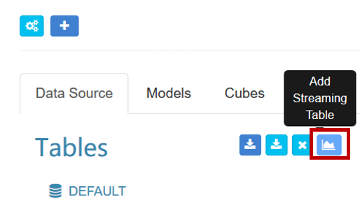
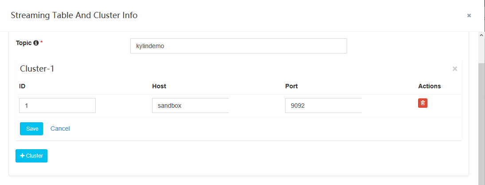
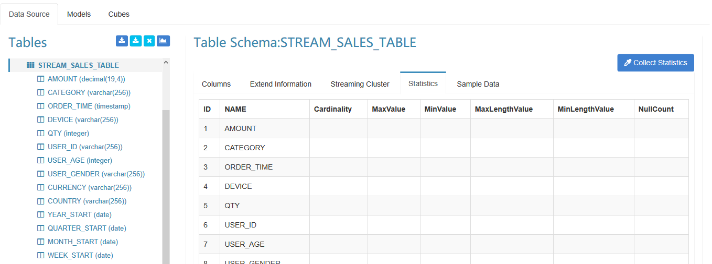
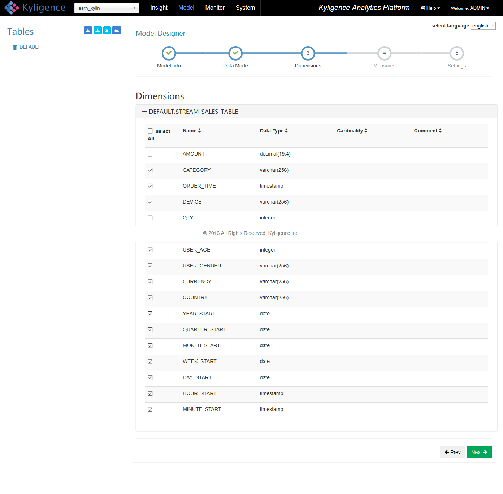
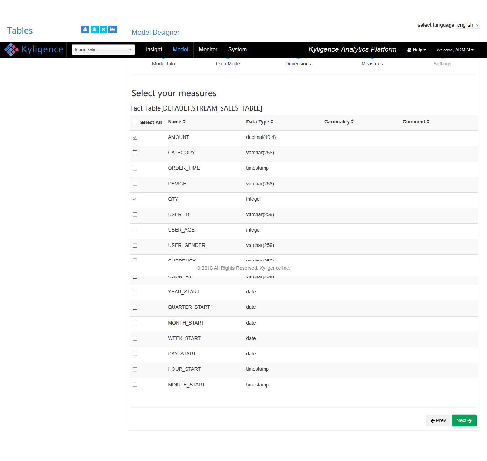
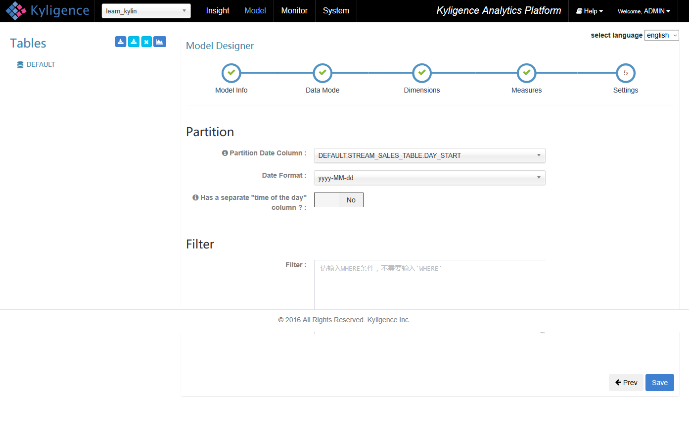
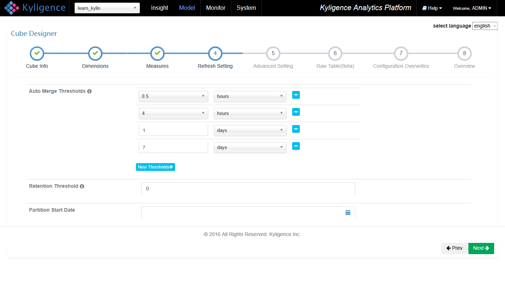
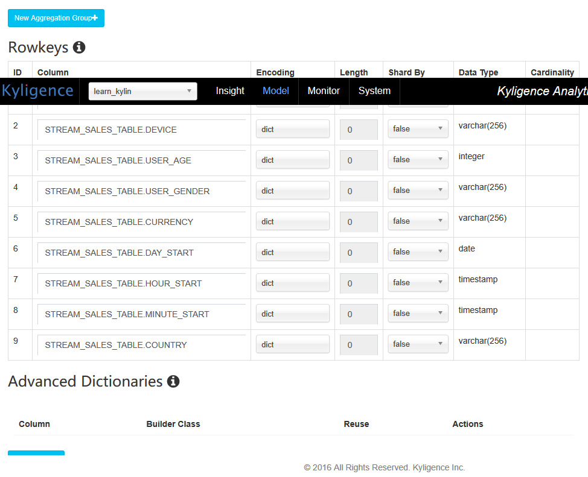
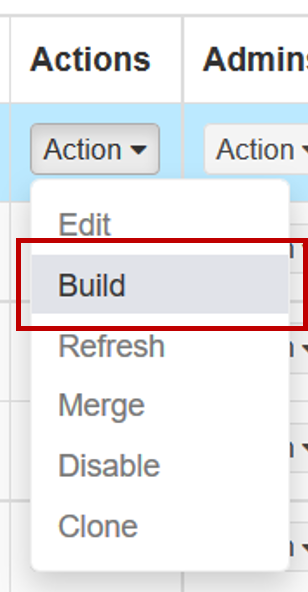
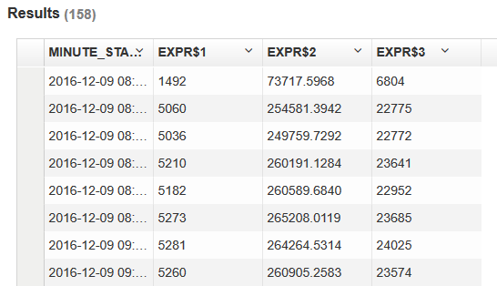

# Streaming Cube


## Preparation

To finish this tutorial, you need a Hadoop environment which has kylin v1.6.0 (KAP V2.2.0) or above installed, and also have a Kafka (v0.10.0 or above) running; previous Kylin version has several issues, so please upgrade your Kylin instance at first.

In this tutorial, we will use **Hortonworks HDP 2.2.4 Sandbox VM** + **Kafka v0.10.0(Scala 2.10)** as the environment.

## Install Kafka 0.10.0.0 and Kylin

Don’t use HDP 2.2.4's build-in Kafka as it is too old, stop it first if it is running.

```
curl -s http://mirrors.tuna.tsinghua.edu.cn/apache/kafka/0.10.0.0/kafka_2.10-0.10.0.0.tgz | tar -xz -C /usr/hdp/current/

cd /usr/hdp/current/kafka_2.10-0.10.0.0/

bin/kafka-server-start.sh config/server.properties &
```

Download the Kylin v1.6 from download page, expand the tar ball in **/root/ folder**.


## Create sample Kafka topic and populate data

Create a sample topic “kylindemo”, with 3 partitions:

```
bin/kafka-topics.sh --create --zookeeper localhost:2181 --replication-factor 1 --partitions 3 --topic kylindemo
Created topic "kylindemo".
```

Input sample data to this topic, Kylin has an utility class which can do this.

```
export KAFKA_HOME=/usr/hdp/current/kafka_2.10-0.10.0.0
export KYLIN_HOME=/root/apache-kylin-1.6.0-SNAPSHOT-bin

cd $KYLIN_HOME
./bin/kylin.sh org.apache.kylin.source.kafka.util.KafkaSampleProducer --topic kylindemo --broker localhost:9092
```

This tool will send 100 records to Kafka every second. Please keep it running during this tutorial. You can check the sample message with kafka-console-consumer.sh now:

```
cd $KAFKA_HOME
bin/kafka-console-consumer.sh --zookeeper localhost:2181 --bootstrap-server localhost:9092 --topic kylindemo --from-beginning
{"amount":63.50375137330458,"category":"TOY","order_time":1477415932581,"device":"Other","qty":4,"user":{"id":"bf249f36-f593-4307-b156-240b3094a1c3","age":21,"gender":"Male"},"currency":"USD","country":"CHINA"}
{"amount":22.806058795736583,"category":"ELECTRONIC","order_time":1477415932591,"device":"Andriod","qty":1,"user":{"id":"00283efe-027e-4ec1-bbed-c2bbda873f1d","age":27,"gender":"Female"},"currency":"USD","country":"INDIA"}
```


## Define a table from streaming

Here we will illustrate how to create and build streaming cube via [KAP Web GUI](http://demokap1.chinacloudapp.cn:7070/kylin/login). Select an existing project or create a new project then click “**Model**” --> “**Data Source**”--> “**Add Streaming Table**”.



**STEP1**: In the pop-up dialogue, enter a sample record which you got from the kafka-console-consumer, click the “**»**” button, KAP parses the JSON message and listS all the properties. You need give a logic table name for this streaming data source; The name will be used for SQL query later; here enter “STREAM_SALES_TABLE” as an example in the “**Table Name**” field.


You need to select a timestamp field which will be used to identify the time of a message. KAP can derive other time values like “year_start”, “quarter_start” from this time column, which can give your more flexibility on building and querying the cube. Check “order_time” a little while, you can deselect those properties which are not needed for Cube. Also, if you feel bothered to change them, let them be is fine as well. You can click “**Next**” to move on.

Notice that KAP supports structured (or say “embedded”) message from v2.1, it will convert them into a flat table structure. By default use “_” as the separator of the structed properties.


**STEP2**: On the setting page, Kafka cluster information is offered: you can enter “kylindemo” as “**Topic**” name. The cluster has 1 broker, whose host name is “sandbox”, port is “9092”, then click “**Save**” .



In “**Advanced setting**” section, the “timeout” and “buffer size” are the configurations for connecting with Kafka, just keep them.


In “**Parser Setting**”, by default Kylin assumes your message is JSON format, and each record's timestamp column (specified by “tsColName”) is a bigint (epoch time) value. In this case, you just need to set the “tsColumn” to “order_time”. Click “**Submit**” to save the configurations. Now a “Streaming” table is created as shown below.



**Notice**: In real case if the timestamp value is a string valued timestamp like “Jul 20, 2016 9:59:17 AM”, you need specify the parser class with “tsParser” and the time pattern with “tsPattern” like this:


## Create data model

With the table defined in previous steps, now we can create the data model. Creating a streaming data model is almost the same as creating a normal data model, but it has **a little difference**, so we would introduce key steps below.

**STEP1**: Streaming Cube doesn’t support to join with lookup tables. So when you create the data model, please only select fact table, don't add lookup table. 


**STEP2**: You need to pick dimension and measure columns.




**STEP3**: Streaming Cube must be partitioned. If you would like to build the Cube incrementally at minutes level, select “MINUTE_START” as the cube’s partition date column. If hours level is desired, you should select “HOUR_START”. Don’t use “order_time” as partition column as it is too fine-grained to aggregate. Please be noticed that partition columns have to be as dimensions in Cube creating. Finally, "**save**" the data model.



## Create Cube

The streaming Cube is almost the same as a normal cube, except some difference within several key steps which need you to pay attention to:

**STEP1**: The partition time column should be a dimension of the Cube. In Streaming OLAP the time is always a query condition, and Kylin will leverage this to narrow down the scanned partitions. Don’t use "order_time” as dimension for it is too fine-grained. We suggest to use “mintue_start”, “hour_start” or others, mainly depends on how you would like to inspect the data. 

**STEP2**: In the “**refresh setting**”, you can create more merge ranges, which help to control the cube segment number. For instance, 0.5 hour, 4 hours, 1 day, and then 7 days. 



**STEP3**: In the "**Aggregation group**" section, define “year_start”, “quarter_start”, “month_start”, “day_start”, “hour_start”, “minute_start” as a hierarchy to reduce the combinations to calculate. 

**STEP4**: In the “**Rowkeys**” section, drag and drop the “minute_start” to the head position, as for streaming queries, the time condition is always appeared; putting it to head will help to narrow down the scan range.




## Build Cube

You can trigger the build from web GUI, by clicking “**Actions**” --> “**Build**”, or sending a request to Kylin RESTful API with ‘curl’ command:

```
curl -X PUT --user ADMIN:KYLIN -H "Content-Type: application/json;charset=utf-8" -d '{ "sourceOffsetStart": 0, "sourceOffsetEnd": 9223372036854775807, "buildType": "BUILD"}' http://localhost:7070/kylin/api/cubes/{your_cube_name}/build2
```



Please note the API endpoint is different from a normal cube (this URL end with “build2”).

Here **0** means from the last position, and 9223372036854775807 (Long.MAX_VALUE) means at the end position on Kafka topic. If it is the first time to build (no previous segment), Kylin will seek to beginning of the topics as the start position.

In the “Monitor” page, a new job is generated. Wait it 100% finished.


## Click the “Insight” tab, compose a SQL to run, e.g:

```
select minute_start, count(*), sum(amount), sum(qty) from stream_sales_table group by minute_start order by minute_start
```

The result would look like below:



## Automate the build

Once the first build and query got successfully, you can schedule incremental builds at a certain frequency. KAP will record the offsets of each build. When receiving a build request, it will start from the last end position, and then seek the latest offsets from Kafka. You can redo the build Cube job manually; or with the REST API, you can trigger it with any scheduler tools like Linux cron:

```
crontab -e
*/5 * * * * curl -X PUT --user ADMIN:KYLIN -H "Content-Type: application/json;charset=utf-8" -d '{ "sourceOffsetStart": 0, "sourceOffsetEnd": 9223372036854775807, "buildType": "BUILD"}' http://localhost:7070/kylin/api/cubes/{your_cube_name}/build2
```

Now you can site down and watch the cube be automatically built from streaming. And when the cube segments accumulate to bigger time range, Kylin will automatically merge them into a bigger segment.


## Trouble shootings

- You may encounter the following error when run “kylin.sh”:

```
Exception in thread "main" java.lang.NoClassDefFoundError: org/apache/kafka/clients/producer/Producer
	at java.lang.Class.getDeclaredMethods0(Native Method)
	at java.lang.Class.privateGetDeclaredMethods(Class.java:2615)
	at java.lang.Class.getMethod0(Class.java:2856)
	at java.lang.Class.getMethod(Class.java:1668)
	at sun.launcher.LauncherHelper.getMainMethod(LauncherHelper.java:494)
	at sun.launcher.LauncherHelper.checkAndLoadMain(LauncherHelper.java:486)
Caused by: java.lang.ClassNotFoundException: org.apache.kafka.clients.producer.Producer
	at java.net.URLClassLoader$1.run(URLClassLoader.java:366)
	at java.net.URLClassLoader$1.run(URLClassLoader.java:355)
	at java.security.AccessController.doPrivileged(Native Method)
	at java.net.URLClassLoader.findClass(URLClassLoader.java:354)
	at java.lang.ClassLoader.loadClass(ClassLoader.java:425)
	at sun.misc.Launcher$AppClassLoader.loadClass(Launcher.java:308)
	at java.lang.ClassLoader.loadClass(ClassLoader.java:358)
	... 6 more
```

The reason is Kylin wasn’t able to find the proper Kafka client jars. Make sure you have properly set “KAFKA_HOME” environment variable.

- Get “killed by admin” error in the “Build Cube” step

Within a Sandbox VM, YARN may not allocate the requested memory resource to MR job as the “inmem” cubing algorithm requests more memory. You can bypass this by requesting less memory: edit “conf/kylin_job_conf_inmem.xml”, change the following two parameters like this:

```
<property>
        <name>mapreduce.map.memory.mb</name>
        <value>1072</value>
        <description></description>
    </property>

    <property>
        <name>mapreduce.map.java.opts</name>
        <value>-Xmx800m</value>
        <description></description>
    </property>
```

- If there already be bunch of history messages in Kafka and you don’t want to build from the very beginning, you can trigger a call to set the current end position as the start for the cube:

```
curl -X PUT --user ADMIN:KYLIN -H "Content-Type: application/json;charset=utf-8" -d '{ "sourceOffsetStart": 0, "sourceOffsetEnd": 9223372036854775807, "buildType": "BUILD"}' http://localhost:7070/kylin/api/cubes/{your_cube_name}/init_start_offsets
```

- If some build job got error and you discard it, there will be a hole (or say gap) left in the Cube. Since each time Kylin will build from last position, you couldn’t expect the hole be filled by normal builds. Kylin provides API to check and fill the holes

Check holes:

```
curl -X GET --user ADMINN:KYLIN -H "Content-Type: application/json;charset=utf-8" http://localhost:7070/kylin/api/cubes/{your_cube_name}/holes
```

If the result is an empty arrary, means there is no hole. Otherwise, trigger Kylin to fill them:

```
curl -X PUT --user ADMINN:KYLIN -H "Content-Type: application/json;charset=utf-8" http://localhost:7070/kylin/api/cubes/{your_cube_name}/holes
```


### Reference

[Scalable Cubing from Kafka (beta)](http://kylin.apache.org/docs16/tutorial/cube_streaming.html) (Shaofeng Shi)

[New NRT Streaming in Apache Kylin](http://kylin.apache.org/blog/2016/10/18/new-nrt-streaming/) (Shaofeng Shi) 


