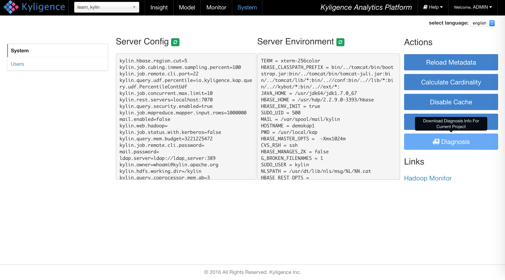
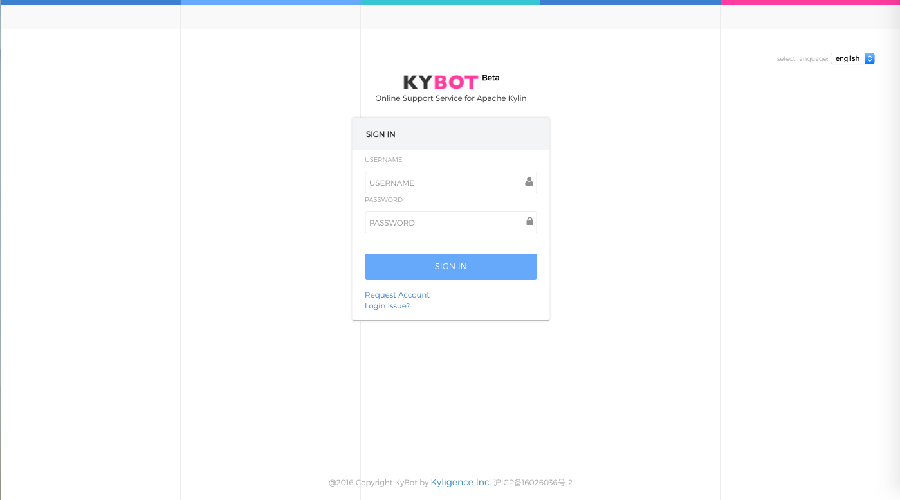
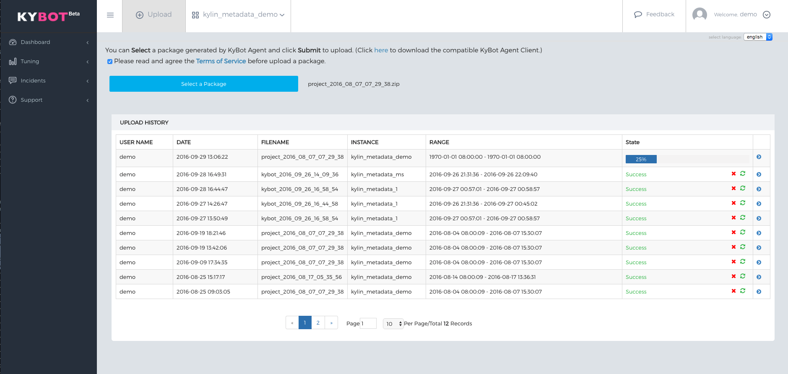
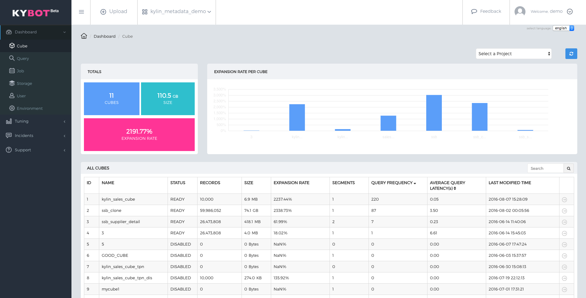
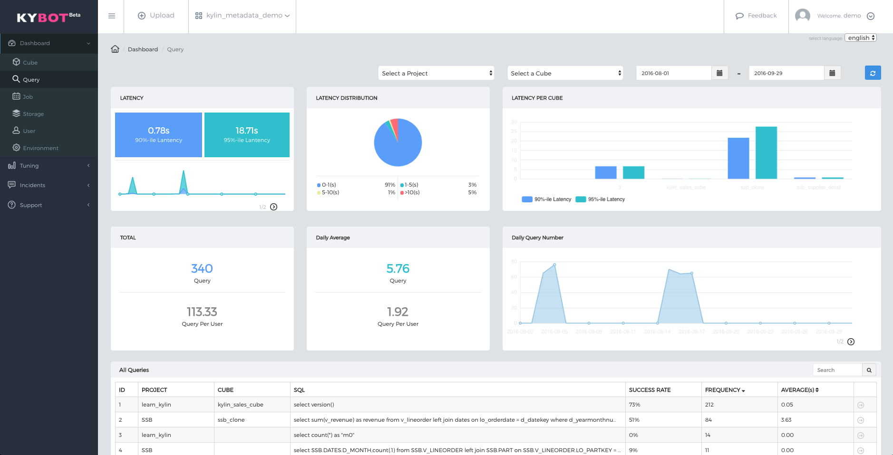
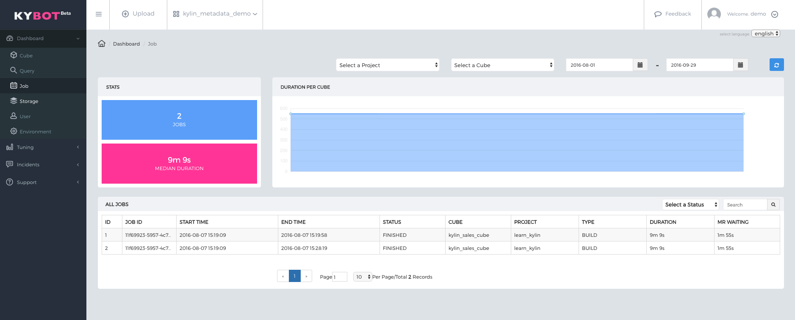
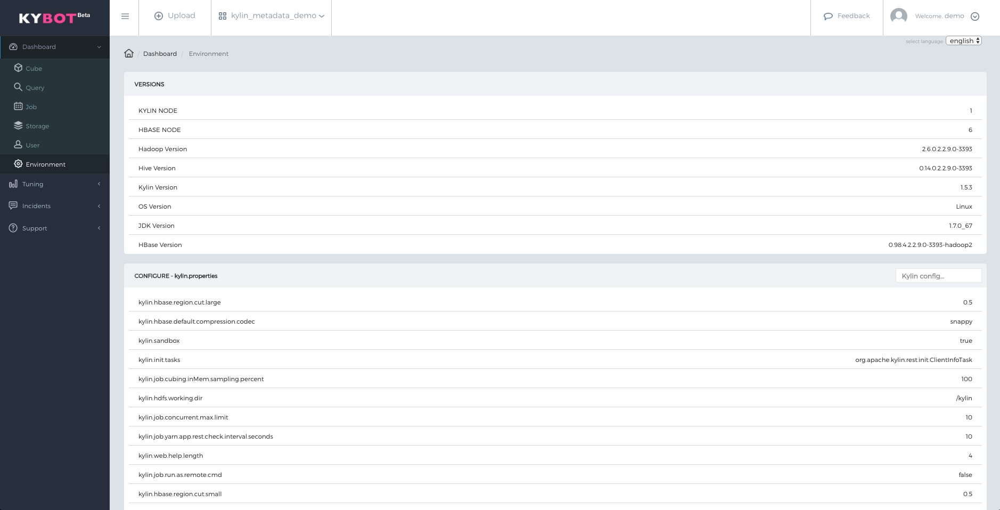
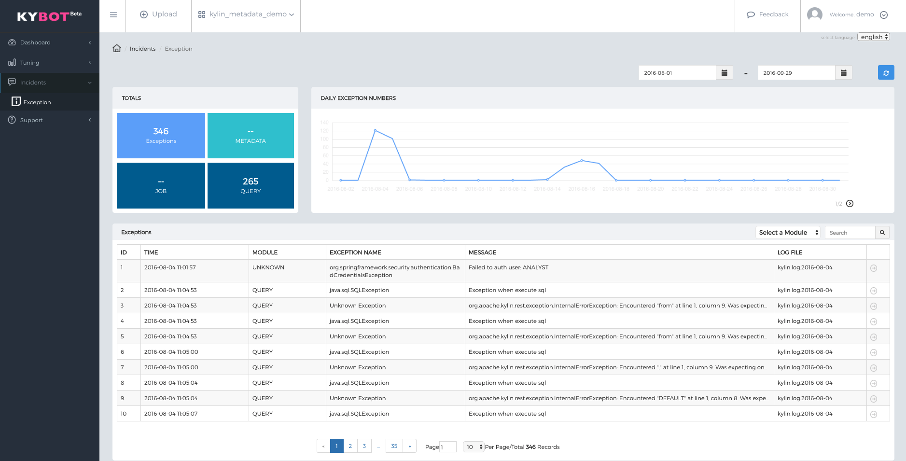

KAP users may face some hard work such as cube building failed, SQL executing failed, query latency timeout etc. OPS team need to dump related information for trouble shooting. Besides, users have the needs to ask experts for help, in which situation user could leverage Kyligence's online support service -- KyBot, based on exports knowledge base, to diagnose/tune their KAP instances and ask technical support.

# Diagnosis
KAP provides a function called "Diagnosis" on Web UI, which will extract related system information into a zip package, to help OPS team for trouble shooting.

## System Diagnosis
Click 'Diagnosis' button on System page, then package of Kylin instance's information will be genrated.


## Job Diagnosis
Click 'Diagnosis' button under one job on Monitor page, then package of current job will be genrated.


# Leverage KyBot
KyBot is an online analyzing, trouble shooting, optimization support service for Apache Kylin, provided by Kyligence. User can generate diagnosis package with KyBot Agent, and upload to KyBot platform, to get insight of KAP healthy, such as performance, storage etc.

## User login
KyBot login: http://kybot.io

Currently KyBot is under internal test. Please contact [support@kyligence.io](mailto:support@kyligence.io) to apply a test account at first time.



## Generate KyBot Package
(Only for KAP users) KyBot Agent is embeded in KAP. Just click 'Diagnosis' button in System page, the generated diagnosis package can be directly used for KyBot.

(For Apache Kylin / KAP users) Download KyBot Agent binary package from KyBot website, and extract to Kylin's home, such as $KYLIN_HOME/kybot, and type following command:

```
$KYLIN_HOME/kybot/kybot.sh
```

Once the execution finished, user can retrieve KyBot package path from output:
```
2016-09-29 12:56:59,102 INFO  [main AbstractInfoExtractor:129]:
========================================
Dump kybot package locates at:
/root/kylin-kap-2.1-beta-bin/kybot_dump/kybot_2016_09_29_12_56_26/kybot_2016_09_29_12_56_26_0D9858.zip
========================================
```

## Upload KyBot Package
1. Login KyBot Website, click 'Upload' button on top of page
2. Click 'Select a package', select and upload the prepared KyBot package, and wait for complete
3. The package pushed to analyzing queue, and user can tracking the progress on upload page



## Dashboard
User can view the dashboard of KAP instances after package analyzing finished.

User could switch dashboard from left navigation panel, to view statistics information of different modules.








## Incidents
KyBot can detect incidents from logs, and presents the statistics and list. User can click 'Incidents > Exceptions' on left navigation panel.



## Technical Support
User can request techinial support from Kyligence with KyBot. Click 'Support' in left navigation panel, user can create tickets based on uploaded packages.

