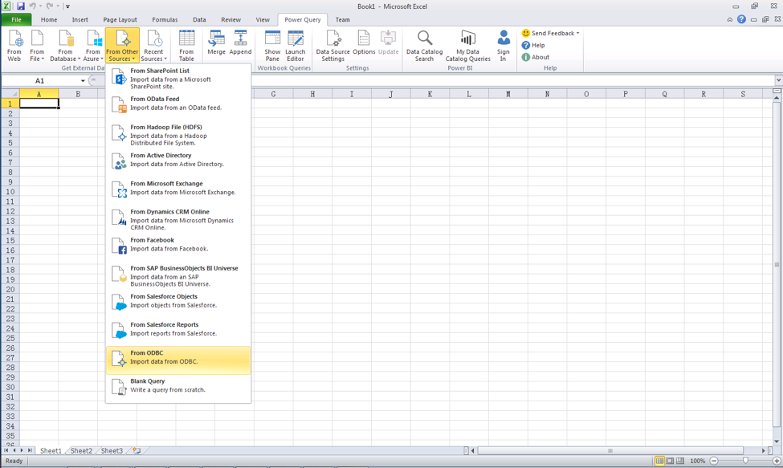
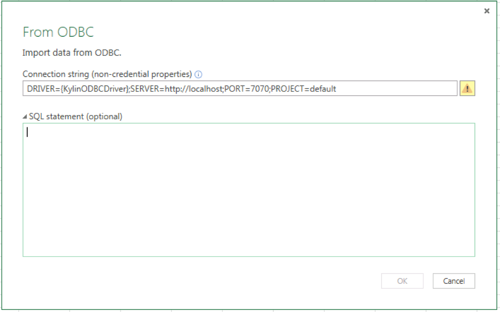
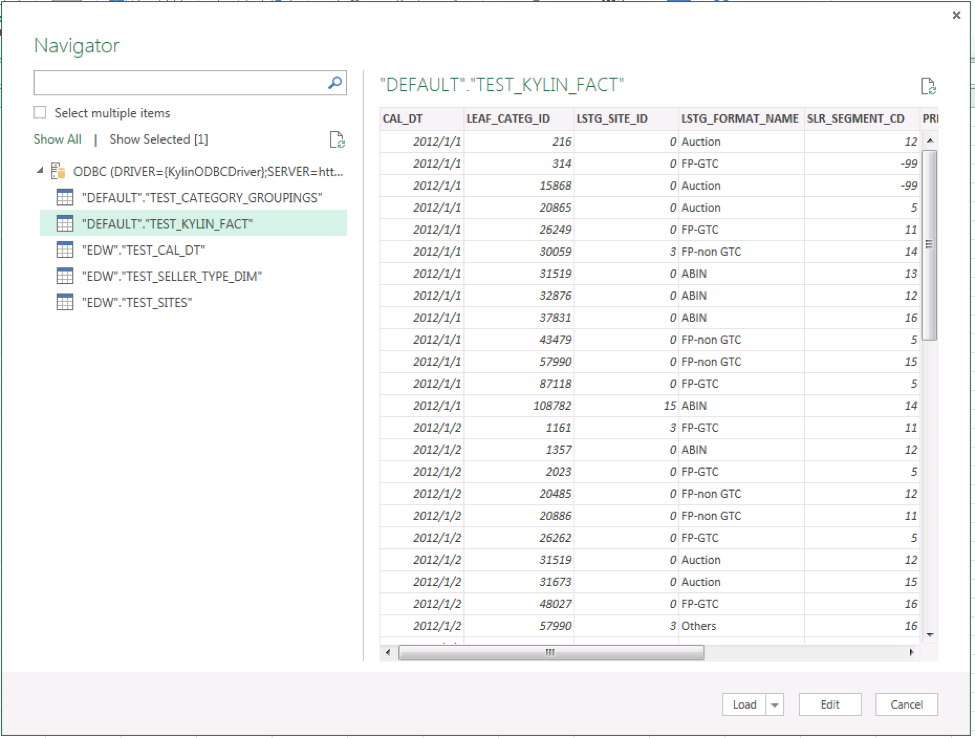
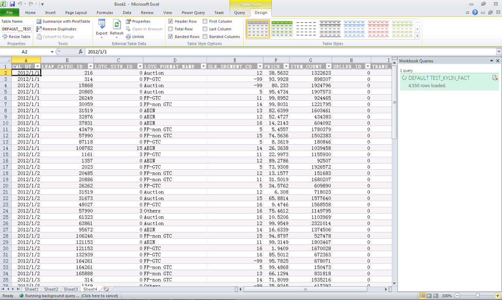
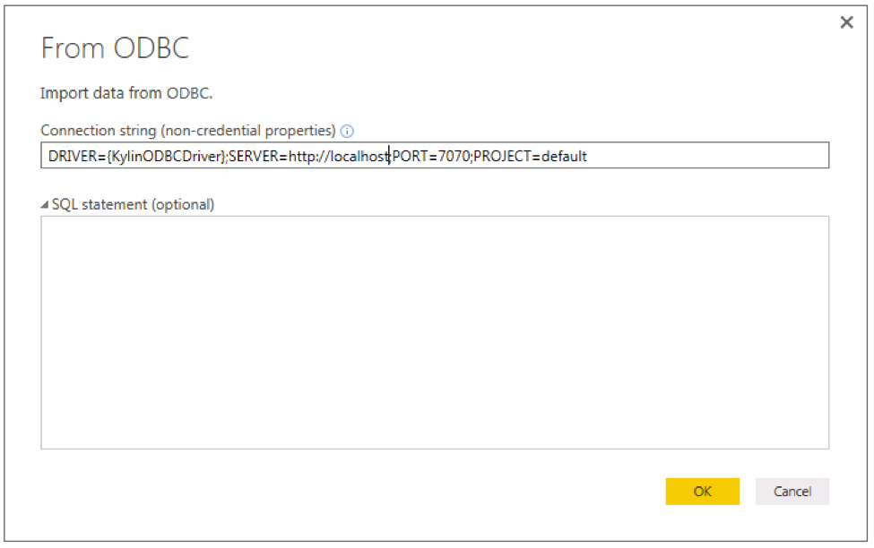
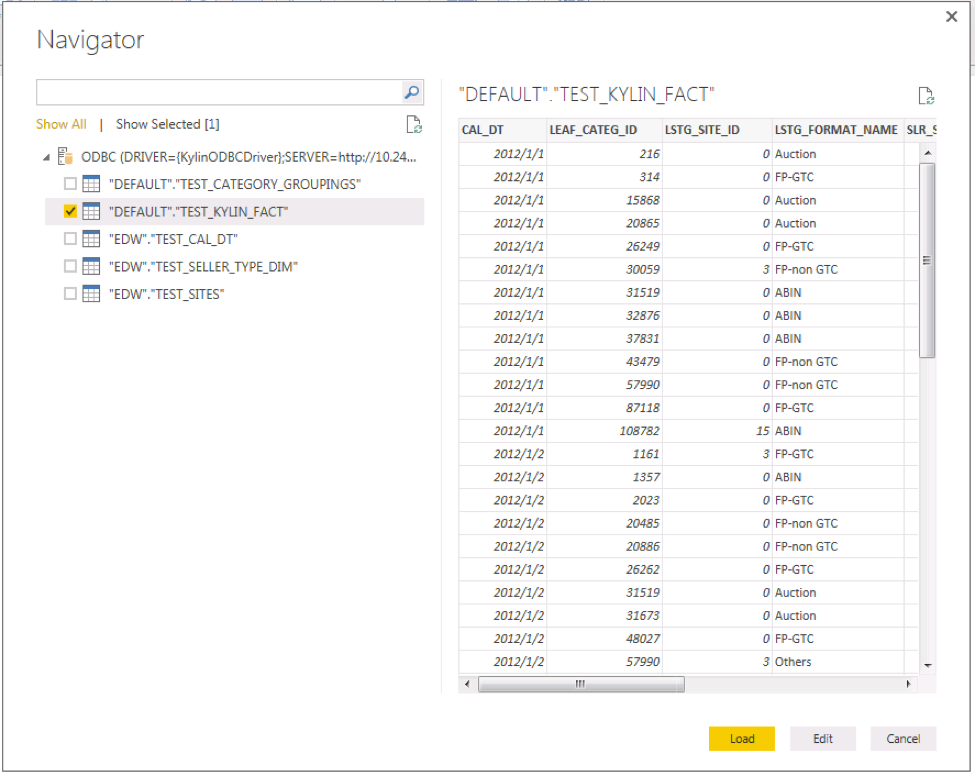
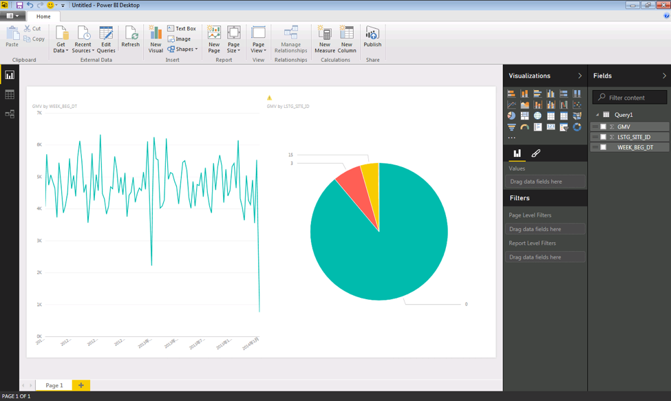

## Excel & PowerBI 集成

Microsoft Excel 是当今Windows平台上最流行的数据处理软件之一，支持多种数据处理功能，可以利用Power Query从ODBC数据源读取数据并返回到数据表中。

Microsoft Power BI 是由微软推出的商业智能的专业分析工具，给用户提供简单且丰富的数据可视化及分析功能。

> Power BI及Excel不支持"connect live"模式，请注意并添加where条件在查询超大数据集时候，以避免从服务器拉去过多的数据到本地，甚至在某些情况下查询执行失败。

### Install ODBC Driver
参考页面[Kylin ODBC 驱动程序教程](../driver/odbc.cn.md)，请确保下载并安装Kylin ODBC Driver __v1.5__. 如果你安装有早前版本，请卸载后再安装。 

### 连接Excel到KAP
1. 从微软官网下载和安装Power Query，安装完成后在Excel中会看到Power Query的Fast Tab，单击`From other sources`下拉按钮，并选择`From ODBC`项
   

2. 在弹出的`From ODBC`数据连接向导中输入KAP服务器的连接字符串，也可以在`SQL`文本框中输入您想要执行的SQL语句，单击`OK`，SQL的执行结果就会立即加载到Excel的数据表中
   

> 为了简化连接字符串的输入，推荐创建KAP的DSN，可以将连接字符串简化为DSN=[YOUR_DSN_NAME]，有关DSN的创建请参考：[https://support.microsoft.com/en-us/kb/305599](https://support.microsoft.com/en-us/kb/305599)。

3. 如果您选择不输入SQL语句，Power Query将会列出所有的数据库表，您可以根据需要对整张表的数据进行加载。但是，KAP暂不支持原数据的查询，部分表的加载可能因此受限
   
4. 稍等片刻，数据已成功加载到Excel中
   
5. 一旦服务器端数据产生更新，则需要对Excel中的数据进行同步，右键单击右侧列表中的数据源，选择`Refresh`，最新的数据便会更新到数据表中。
6. 为了提升性能，可以在Power Query中打开`Query Options`设置，然后开启`Fast data load`，这将提高数据加载速度，但可能造成界面的暂时无响应

### Power BI
1.  启动您已经安装的Power BI桌面版程序，单击`Get data`按钮，并选中ODBC数据源.
    

2.  在弹出的`From ODBC`数据连接向导中输入KAP服务器的数据库连接字符串，也可以在`SQL`文本框中输入您想要执行的SQL语句。单击`OK`，SQL的执行结果就会立即加载到Power BI中
    

3.  如果您选择不输入SQL语句，Power BI将会列出项目中所有的表，您可以根据需要将整张表的数据进行加载。但是，KAP暂不支持原数据的查询，部分表的加载可能因此受限
    

4.  现在你可以进一步使用Power BI进行可视化分析：
    

5.  单击工具栏的`Refresh`按钮即可重新加载数据并对图表进行更新

    ​

