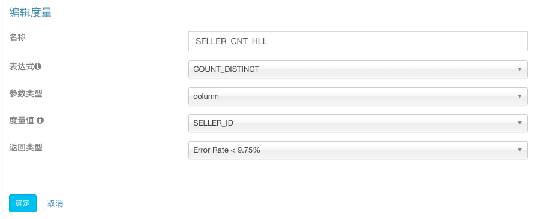
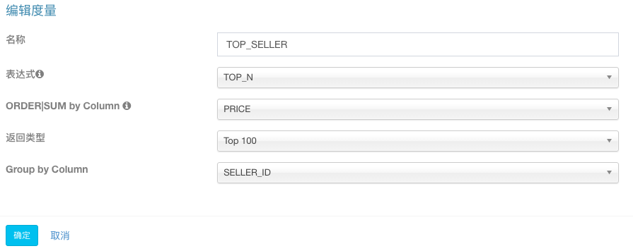
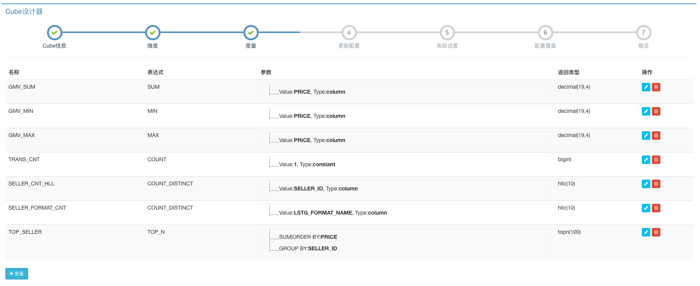

## 创建Cube

在创建好数据模型的基础上，我们还需要根据查询需求定义度量的预计算类型、维度的组合等，这个过程就是Cube设计的过程。本文将以KAP自带的样例数据为例，介绍Cube的创建过程。


打开KAP的Web UI，首先选择KAP\_Sample\_1项目，跳转到模型页面，然后按照下图所示创建一个Cube。


第一步，在“模型名称”中选择Sample\_Model\_1，输入新建Cube的名称Sample\_Cube\_1，其余字段保持默认，然后单击“下一步”。


第二步，从数据模型的维度中选择一些列作为Cube的维度。这里的设置会影响到生成的Cuboid数量，进而影响Cube的数据量大小。
在KYLIN\_CATEGORY\_GROUPINGS表里，和商品分类相关的三个字段（META\_CATEG\_NAME、CATEG\_LVL2\_NAME、CATEG\_LVL3\_NAME）都可能出现在过滤条件中，我们先把他们添加为普通类型维度。因为从查询表上添加普通维度不能通过自动生成器（Auto Generator）生成，因此采用手动添加方式，过程如下：

1. 单击“添加维度”按钮，然后选择“普通维度”。
2. 针对每一个维度字段，首先在Name输入框中输入维度名称，在Table Name中选择KYLIN_CATEGORY_GROUPINGS表，然后在Column Name中选择相应的列名。

此外，在查询中还经常把时间作为过滤或聚合的条件，如按周过滤、按周聚合等。这里我们以按周为例，需要用到KYLIN_CAL_DT中的WEEK_BEG_DT字段，但是该字段实际上可以由PART_DT字段决定，即根据每一个PART_DT值可以对应出一个WEEK_BEG_DT字段，因此，我们添加WEEK_BEG_DT字段为可推倒维度。
同样的，KYLIN_CATEGORY_GROUPINGS表中还有一些可作为可推到维度的字段，如USER_DEFINED_FIELD1、USER_DEFINED_FIELD3、UPD_DATE、UPD_USER等。

在事实表上，表征交易类型的LSTG_FORMAT_NAME字段也会用于过滤或聚合条件，因此，我们再添加LSTG_FORMAT_NAME字段作为普通维度。
最终，维度的设置结果如下图所示：


第三步，根据数据分析中的聚合需求，我们需要为Cube定义度量的聚合形式。默认的，根据数据类型，系统会自动创建好一些COUNT()聚合和SUM()聚合，用于考量交易订单的数量或者卖出商品的总量。默认建好的聚合仍然可以手动修改或删除。在这个案例中，我们还需要通过PRICE的不同聚合形式考量销售额，如总销售额为SUM(PRICE)、最高订单金额为MAX(PRICE)、最低订单金额为MIN(PRICE)。因此，我们手动创建三个度量，分别选择聚合表达式为SUM、MIN、MAX，并选择PRICE列作为目标列。


其次，我们还需要通过COUNT(DISTINCT SELLER_ID)考量卖家个数。根据前面章节的介绍，KAP默认使用HyperLogLog算法进行COUNT_DISTINCT的计算，该算法是个近似算法，在创建度量时需要选择一个近似度，本案例对精确性要求不高，为了提升查询性能，我们选择精度较低的“Error Rate < 9.75%”。同样的，我们再创建一个COUNT(DISTINCT LSTG_FORMAT_NAME)的度量考量不同条件下的交易类型。


在销售业务分析的场景中，往往需要挑选出销售业绩最好的商家，这时候就需要TOP-N的度量了。在这个例子中，我们会选出SUM(PRICE)最高的一些SELLER_ID，实际上就是执行如下的SQL语句：

```sql
SELECT SELLER_ID, SUM(PRICE) FROM KYLIN_SALES 
GROUP BY SELLER_ID 
ORDER BY SUM(PRICE)
```
因此，我们创建一个TOP-N的度量，选择PRICE字段作为SUM/OPDERBY字段，选择SELLER_ID字段作为GROUP BY字段，并选择TOPN(100)作为度量的精度。


最终添加的度量如下图所示：


第四步，我们对Cube的构建和维护进行配置。一般的，一个销售统计的SQL查询往往会按月、周进行过滤和聚合，所以我们可以设置Cube自动按周、月进行自动合并，即每7天进行一次合并，每4周（28天）进行一次合并，设置“触发自动合并的时间阀值”如下所示：


因为存在对于历史订单的查询需求，我们在此不对Cube做自动清理，所以需要设置“保留时间阀值”为0。

在创建数据模型的时候我们提到，我们希望采用增量构建方式对Cube进行构建，并选择了PART_DT字段作为分区时间列。在创建Cube时，我们需要指定Cube构建的起始时间，在这个例子中，根据样例数据中的时间条件，我们选择2012-01-01 00:00:00作为分区起始时间。


第五步，通过对Cube进行高级设置优化Cube的存储大小和查询速度，主要包括聚合组和Rowkey。在第六章我们提到，添加聚合组可以利用字段间的层级关系和包含关系有效地降低Cuboid的数量。在这个案例当中，与商品分类相关的三个字段（META_CATEG_NAME、CATEG_LVL2_NAME、CATEG_LVL3_NAME）实际上具有层级关系，如一级类别（META_CATEG_NAME）包含多个二级类别（CATEG_LVL2_NAME），二级类别又包含多个三级类别（CATEG_LVL3_NAME），所以，我们可以为它们创建层级结构的组合（Hierarchy Dimensions）。最终，聚合组的设计如下图所示：


由于参与Cuboid生成的维度都会作为Rowkey，因此我们需要把这些列添加为Rowkey当中。在这个案例中，总共需要添加7个Rowkey。在每个Rowkey上，还需要为列值设置编码方法。在这个案例中，我们除了把LSTG_FORMAT_NAME设置为fixed_length类型（长度为12）外，将其余的Rowkey都设置为dict编码。 
Rowkey的顺序对于查询性能来说至关重要，如第六章所讲，一般把最经常出现在过滤条件中的列放置在Rowkey的前面，在这个案例中，我们首先把PART_DT放在Rowkey的第一位。接下来，按照层级把商品分类的字段跟随其后。最终，Rowkey的设置如下图所示：


> **对Plus版本**：Raw Table是Plus版本的特有功能。如果启用，KAP将在构建Cube之外也保存所有的原始记录，支持高速的明细查询。Raw Table还处于beta测试阶段，仅支持最简单的启用或者不启用。其他的Raw Table配置参数暂时不起作用。

第六步，设置Cube的配置覆盖。在这里添加的配置项可以在Cube级别覆盖从kylin.properties配置文件读取出来的全局配置。在这个案例中，我们可以直接采用默认配置，在此不做任何修改。
​	
第七步，对Cube的信息进行概览。请读者仔细确认这些基本信息，包括数据模型名称、事实表以及维度和度量个数。确认无误后单击“保存”按钮，并在弹出的确认提示框中选择“Yes”。
​	
最终，Cube的创建就完成了。我们可以刷新Model页面，在Cube列表中就可以看到新创建的Cube了。因为新创建的Cube没有被构建过，是不能被查询的，所以状态仍然是“禁用”。

