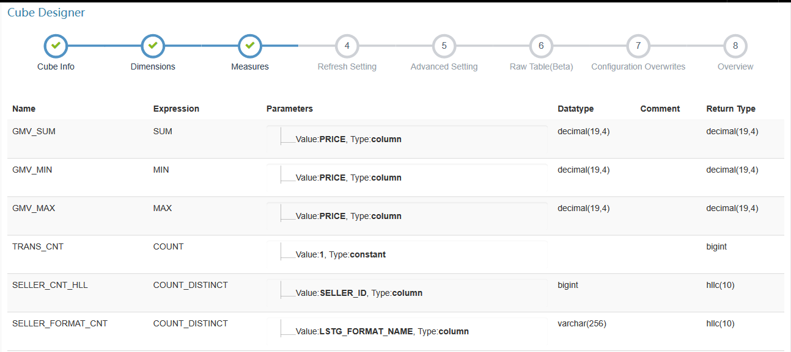
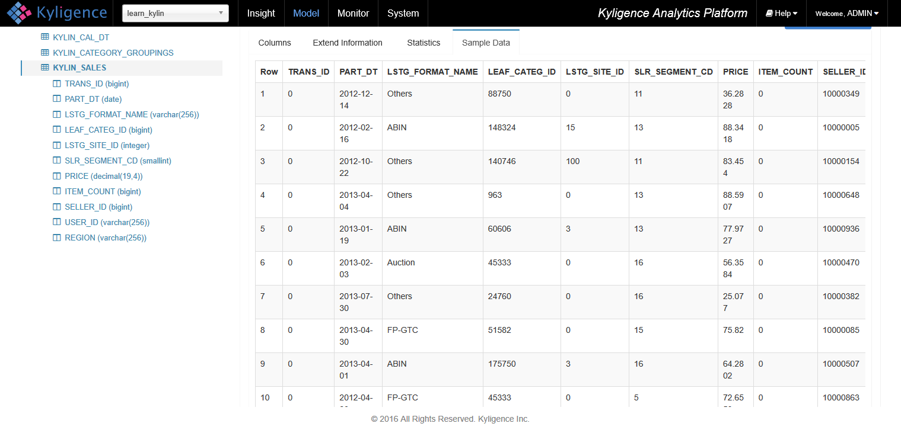

# Approximate Count Distinct

Count distinct is a frequent-used function for most data analysts. Since KAP v2.1, KAP implements approximately count distinct using [HyperLogLog](https://hal.inria.fr/hal-00406166/document) algorithm, offered serveral precision, with the error rates from 9.75% to 1.22%. The result of measure has theorically upper limit in size, as 2^N bytes. For the max precision N=16, the upper limit is 64KB, and the max error rate is 1.22%. It would be perfectly fit if you don't require a particularly precise result and have limited storage resource. 

## Prerequisite

Before using count distinct query, you need to clarify if the target column is ready for it. You can get measures information by checking `measures` of built `Cube`(as shown below). If the measure desired has been pre-calculated on approximate count distinct syntax(here requires both `Expression` to be count_distinct and `Return Type` to be hllc), and stored within the Cube information, then this measure is ready to do further count distinct query. Otherwise, you need to create a new Cube.

## Precise Count Distinct Setting 

Firstly, after creating a new Cube and ensure all dimensions selected, then click `Measures+` on the lower left corner to start measures setting.  

Next, choose the column desired from `Param Value` and COUNT_DISTINCT from `Expression`. Here be careful to select accuracy requirement from `Return Type`.  KAP offers both approximate count distinct function and precise count distinct function. To get the pre-calculated approximate count distinct value, you should select  `Return Type: Error Rate<*%` based on HyperLogLog algorithm, which would return a nearly result if you don't require a particularly precise result and have limited storage resource. 

Follow the [Create Cube](molap/create_cube.en.md) introduction for rest steps, the Cube would be ready after you setting segments on the [Build Cube](molap/build_cube.en.md) section.

## Example

Select a default **Data Source** named as `learn_kylin`, then the table structure would present below: there are one fact table (`KYLIN_SALES`) and two lookup tables (`KYLIN_CAL_DT` and `KYLIN_CATEGORY_GROUPINGS`). Take a minute to check the `KYLIN_SALES` as well as its sample data, and we'll use it later.

For instance, input `select count(distinct LSTG_FORMAT_NAME) as num from kylin_sales where part_dt = DATE '2012-01-02'` query in **Insight** dashboard, then result returned in 0.18sec.  

Not only this result but also other testified results are right, which prove that approximate count distinct query works well. More information about precise count distinct function, please refer to [Precise Count Distinct](adv_molap/count_distinct_bitmap.en.md) Introduction.

### Reference

[Use Count Distinct in Apache Kylin](http://kylin.apache.org/blog/2016/08/01/count-distinct-in-kylin/) (Yerui Sun)

