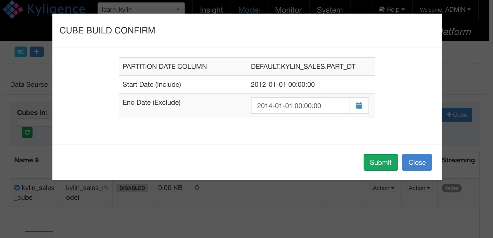

## KAP 快速上手(基于HDP)

KAP内置了样例数据集及模型，可以通过脚本，快速导入数据集和模型。更详细的安装和使用请参考手册相关章节。

### 环境准备

运行KAP需要Hadoop环境支持，KAP安装在Hadoop集群的客户端节点上。作为快速上手，我们推荐使用*All in one*的沙箱虚拟机用于本地测试，包括*Hortonworks Sandbox（HDP） 2.2/2.3/2.4* 和*Cloudera QuickStart VM（CDH） 5.7/5.8*。虚拟机需要至少*10G*内存。

> 由于不同Sandbox采用了不同的HBase版本，安装KAP时需要采用对应的版本。
>
> *HDP 2.2* 请采用*HBase 0.98*版本；*HDP 2.3/2.4* 请采用*HBase 1.X*版本
>
> *CDH 5.7/5.8*请采用CDH版本

为了避免权限问题，我们建议使用*root*账号通过SSH的方式登录虚拟机，*HDP 2.2*的默认密码是*hadoop*， *HDP 2.3/2.4* 请参考[Hortonworks文档](http://zh.hortonworks.com/hadoop-tutorial/learning-the-ropes-of-the-hortonworks-sandbox/)了解账号密码，*Cloudera QuickStart VM 5.7/5.8*的默认密码是cloudera。

以下指南以*root*账户为例。

我们建议采用网桥（bridged）模式配置虚拟机网络，网桥模式将为虚拟机分配独立IP地址，方便本机访问KAP Web页面。

登录Ambari管理门户, [http://{hostname}:8080](http://{hostname}:8080)(默认登录用户名admin, 密码admin)确认HDFS/MapReduce2/YARN/Hive/HBase/ZooKeeper都处于正常运行状态，没有警告信息，可以针对每个服务运行*Service Check*以确认服务状态，特别是HBase服务，需要运行Service Check验证读写权限。


以下配置需要修改，以配合KAP的资源需求

1. 针对*HDP 2.2*，找到YARN-Configs，修改*yarn.nodemanager.resource.memory-mb*为*8192*，*yarn.scheduler.maximum-allocation-mb*为*4096*；针对*HDP 2.3/2.4*，找到YARN-Configs->Settings，修改*Memory Node*为*8192*
2. 针对*HDP 2.3/2.4*，找到MapReduce2-Configs->Advanced，修改*MR Map Java Heap Size*及*MR Reduce Java Heap Size*为 *-Xmx3072m*
3. 如果遇到*org.apache.hadoop.hbase.security.AccessDeniedException: Insufficient permissions for user 'root (auth:SIMPLE)'*这样的异常，表示没有写HBase的权限，可以将*hbase.coprocessor.region.classes*和*hbase.coprocessor.master.classes*设置为空，*hbase.security.authentication*设置为*simple*，*hbase.security.authorization*设置为*false*，以关闭HBase的权限验证。

### 安装KAP
获取KAP安装包请参考[KAP发行说明](../release/README.md)。以下步骤针对KAP，KAP Plus步骤略有不同。

拷贝KAP二进制包至安装机器，并解压至安装目录，本文以*/usr/local*为例

```shell
cd /usr/local
tar -zxvf kap-{version}-{hbase}.tar.gz
```

设置环境变量`KYLIN_HOME`为KAP的解压缩目录。

```shell
export KYLIN_HOME=/usr/local/kap-{version}-{hbase}
```

> KAP Plus需要启动Spark Executor，会占用更多YARN资源，作为单机测试，需要调低Executor占用资源数，请添加（或替换）以下参数：
>
> kap.storage.columnar.conf.spark.driver.memory=512m
>
> kap.storage.columnar.conf.spark.executor.memory=512m
>
> kap.storage.columnar.conf.spark.executor.cores=1
>
> kap.storage.columnar.conf.spark.executor.instances=1

在HDFS上创建KAP工作目录，并授权给KAP用户，能够读写该目录。

```shell
hdfs dfs -mkdir /kylin
hdfs dfs -mkdir /user/root
```

> 如果遇到没有HDFS写权限问题，可以先切换到hdfs账号，创建目录，再授权给*root*账户。
>

```shell
su hdfs
hdfs dfs -mkdir /kylin
hdfs dfs -chown root /kylin
hdfs dfs -mkdir /user/root
hdfs dfs -chown root /user/root
```

### 导入样例数据和模型

`bin/sample.sh`会创建3个Hive Table，并导入样例数据。数据导入成功后，会自动创建样例项目、模型和Cube定义。

```shell
cd kap-{version}-{hbase}
bin/sample.sh
```

成功执行的脚本，最后的输出如下：

> Sample cube is created successfully in project 'learn_kylin'.
> Restart Kylin server or reload the metadata from web UI to see the change.

### 启动 Hadoop

用ambari来启动hadoop

```shell
ambari-agent start
amber-server start
```

命令成功之后，登录ambari  [http://{hostname}:8080](http://{hostname}:8080) (默认登录用户名admin, 密码admin)来检查各项状态。

默认Hbase是禁用的，需要在ambari 主页启动Hbase服务。

 

### 启动KAP

进入KAP安装目录，并执行启动脚本`bin/kylin.sh start`。

```shell
cd kap-{version}-{hbase}
bin/kylin.sh start
```

KAP启动之后，可以通过浏览器访问，默认地址http://{hostname}:7070/kylin，默认用户名ADMIN，密码KYLIN

### 构建Cube

进入KAP后，通过页面左上角的下拉菜单选择样例项目*learn_kylin*。


进入**模型**页面，选择样例Cube *kylin_sales_cube*，选择*操作*->*构建*，选择一个晚于*2014-01-01*的结束日期，这样会包含全部10000条原始数据，并提交。



进入**监控**页面，可以看到正在构建的Cube任务，可以点击*刷新*，获得最新进度，直到100%。


### 执行SQL查询

当Cube构建成功后，进入**查询**页面，可以在页面左侧看到之前导入的三张表，这时可以输入SQL语句，对样例数据进行查询分析。样例语句包括：

```sql
select part_dt, sum(price) as total_selled, count(distinct seller_id) as sellers from kylin_sales group by part_dt order by part_dt
```

查询的结果会呈现在页面中，可以对比Hive验证查询的结果和响应的速度。


